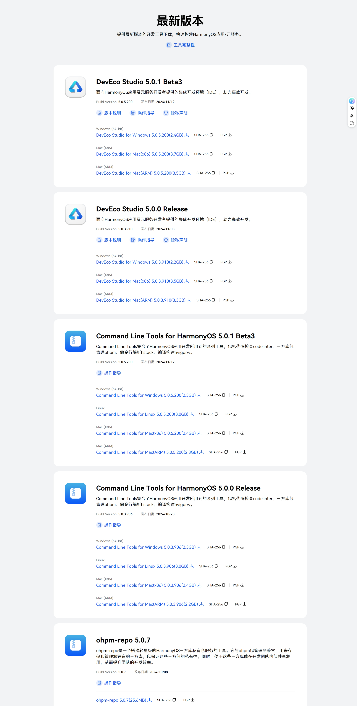
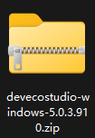
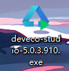
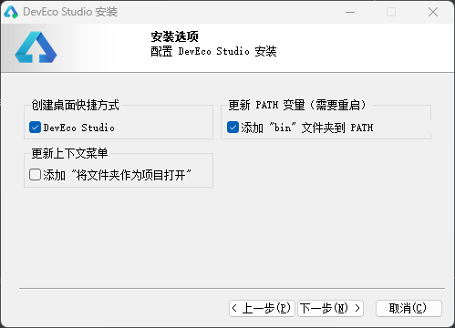

## 工具准备

### 下载并安装最新版 `DevEco Studio`  

#### 下载 
- 备注：需要大家在华为开发联盟网站中注册成为开发者，并完成实名认证
- 下载网址: https://developer.huawei.com/consumer/cn/download/
- 
- 上图是 2024.11.13 所截图片，观察有 Beta(公测版) 和 Release(正式发布版)
- 我下载的是 `Release` 版本，大家根据自己的需求，同时根据自己的配置下载 Window 和 Mac 版本

#### 安装
- 下载下来是如下一个解压包
- 
- 解压出.exe 安装包
- 
- 打开后点击下一步，选择安装目录(不含中文字符)，再次点击下一步，像我这样勾选
- 
- 接着开始安装，结束后需要重启

#### 配置环境
- 双击已安装的 `DevEco Studio` 快捷方式进入,同意相应的条款
- 在我下的这个版本中，`DevEco Studio` 已经自动下载并配置 `Node.js` 以及 `SDK`

#### 新建项目
- 可以选择第一个空的项目，更改项目名称和所存储位置新建项目
- 点击右侧的预览器，显示界面
- 输出内容在 IDE 下侧“日志”查看

下一章：[README.md](..%2Fbasic_grammar%2FREADME.md)