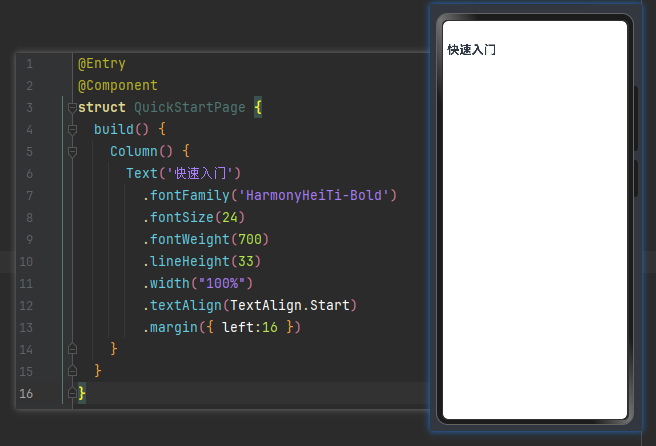

## 从一个简单的页面开始

### ArkUI 两种开发范式
针对不同的应用场景及技术背景，方舟UI框架提供了两种开发范式，分别是基于ArkTS的声明式开发范式（简称“声明式开发范式”）和兼容JS的类Web开发范式（简称“类Web开发范式”）。

- 声明式开发范式：采用基于TypeScript声明式UI语法扩展而来的ArkTS语言，从组件、动画和状态管理三个维度提供UI绘制能力。

- 类Web开发范式：采用经典的HML、CSS、JavaScript三段式开发方式，即使用HML标签文件搭建布局、使用CSS文件描述样式、使用JavaScript文件处理逻辑。该范式更符合于Web前端开发者的使用习惯，便于快速将已有的Web应用改造成方舟UI框架应用。


#### 常用组件
- 按钮 (Button)
- Button 是按钮组件，通常用于响应用户的点击操作，其类型包括胶囊按钮、圆形按钮、普通按钮。Button作为容器使用时可以通过添加子组件实现包含文字、图片等元素的按钮。
- 
- 
- 
- 文本显示 (Text)
- Text 是文本组件，通常用于展示用户视图，如显示文章的文字
- 
- 显示图片 (Image)
- 开发者经常需要在应用中显示一些图片，例如: 按钮中的icon、网络图片、本地图片等。在应用中显示图片需要使用 Image 组件实现，Image 支持多种图片格式，包括png、jpg、bmp、svg和gif。
- 
- 线性布局 (Row/Column)
- 线性布局(LinearLayout)是开发中最常用的布局，通过线性容器Row和Column构建。线性布局的子元素在线性方向上依次排列，Column容器内子元素按照垂直方向排列，Row容器内子元素按照水平方向排列。
- 
- 
- 创建列表 (List)
- 列表是一种复杂的容器，当列表项达到一定数量，内容超过屏幕大小时，可以自动提供滚动功能。它适合用于呈现同类数据类型或数据类型集，例如图片和文本。
- 
- 创建网格 (Grid/GridItem)
- 网格布局是由“行”和“列”分割的单元格所组成，通过指定“项目”所在的单元格做出各种各样的布局。网格布局具有较强的页面均分能力，子组件占比控制能力，是一种重要自适应布局。
- 
- 创建轮播 (Swiper)
- Swiper组件提供滑动轮播显示的能力。Swiper本身是一个容器组件，当设置了多个子组件后，可以对这些子组件进行轮播显示。
- 
- 瀑布流 (WaterFlow)
- 瀑布流容器，由“行”和“列”分割的单元格所组成，通过容器自身的排列规则，将不同大小的“项目”自上而下，如瀑布般紧密布局。
- 
- 其他常用组件：
  - PatternLock 图案密码锁组件，以九宫格的方式进行输入密码，用于密码验证等场景
  - Slider 滑动条组件，通常用于快速调节设置值，比如音量调节、亮度调节等应用场景
  - Tabs 通过页签进行内容视图切换的容器组件，每个页签对应一个内容视图
  - CustomDialog 自定义弹窗组件，使用弹窗组件时可优先考虑自定义弹窗组件，便于自定义弹窗组件的样式与内容
  - 时间日期有关的选择器Picker组件
    - CalendarPicker
    - TextPicker
    - DatePicker
    - TimePicker
- 
- 

### 构建快速入门页


#### 设置快速入门标题

```typescript
@Entry
@Component
struct QuickStartPage {
  build() {
    Column() {
      Text('快速入门')
        .fontFamily('HarmonyHeiTi-Bold')
        .fontSize(24)
        .fontWeight(700)
        .lineHeight(33)
        .width("100%")
        .textAlign(TextAlign.Start)
        .margin({ left:16 })
    }
  }
}
```

#### 使用循环渲染: ForEach


#### 设置轮播图 1 - 显示图片

```typescript
@Entry
@Component
struct QuickStartPage {
  build() {
    Column() {
      Text('快速入门')
        .fontFamily('HarmonyHeiTi-Bold')
        .fontSize(24)
        .fontWeight(700)
        .lineHeight(33)
        .width("100%")
        .textAlign(TextAlign.Start)
        .margin({ left:16 })
      Banner()
    }
  }
}

@Component
struct Banner {
  build() {
    Image($r('app.media.img'))
      .objectFit(ImageFit.Contain)
      .width('100%')
      .padding({ left: 16, right: 16})
      .borderRadius(16)
  }
}
```


#### 设置轮播图 2 - 设置轮播图

```typescript
class BannerClass {
  id: string = '';
  imageSrc: string = '';

  constructor(id: string, imageSrc: string) {
    this.id = id;
    this.imageSrc = imageSrc;
  }
}

@Entry
@Component
struct QuickStartPage {
  build() {
    Column() {
      Text('快速入门')
        .fontFamily('HarmonyHeiTi-Bold')
        .fontSize(24)
        .fontWeight(700)
        .lineHeight(33)
        .width("100%")
        .textAlign(TextAlign.Start)
        .margin({ left:16 })
      Banner()
    }
  }
}

@Preview
@Component
struct Banner {
  @State bannerList: BannerClass[] = [
    new BannerClass('1', 'app.media.banner_img1'),
    new BannerClass('2', 'app.media.banner_img2'),
    new BannerClass('3', 'app.media.banner_img3')
  ];
  private swiperController: SwiperController = new SwiperController();

  build() {
    Swiper(this.swiperController) {
      ForEach(this.bannerList, (item: BannerClass) => {
        Image($r(item.imageSrc))
          .objectFit(ImageFit.Contain)
          .width('100%')
          .padding({left: 16, right: 16 })
          .borderRadius(16)
      }, (item: BannerClass) => item.id)
    }
    .autoPlay(true)
    .loop(true)
  }
}
```


